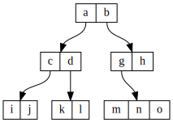
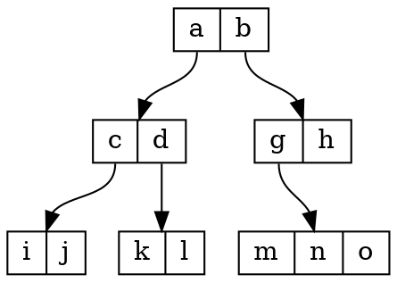

# treeviz

Generate Graphviz Dot for a tree-based data structure from JSON

## Notes
- The JSON layout is chosen to be easily generated, not easily written directly
- More human-friendly input formats may be added as desired

## Examples



JSON input:
```json
{ "id": "Tree", "children": [
  { "id": "a", "children": [
    { "id": "c", "children": [
      { "id": "i", "children": [] },
      { "id": "j", "children": [] }]
    },
    { "id": "d", "children": [
      { "id": "k", "children": [] },
      { "id": "l", "children": [] } ]
    }]
  },
  { "id": "b", "children": [
    { "id": "g", "children": [
      { "id": "m", "children": [] },
      { "id": "n", "children": [] },
      { "id": "o", "children": [] }]
    },
    { "id": "h", "children": [] }]
  }]
}
```

Graphviz Dot output:

